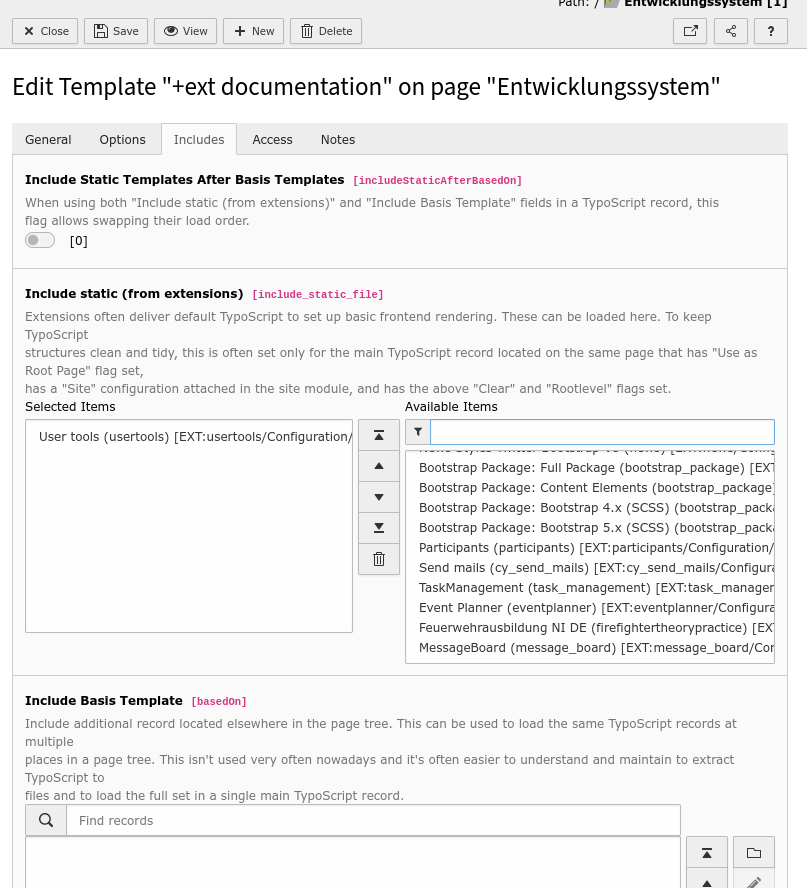
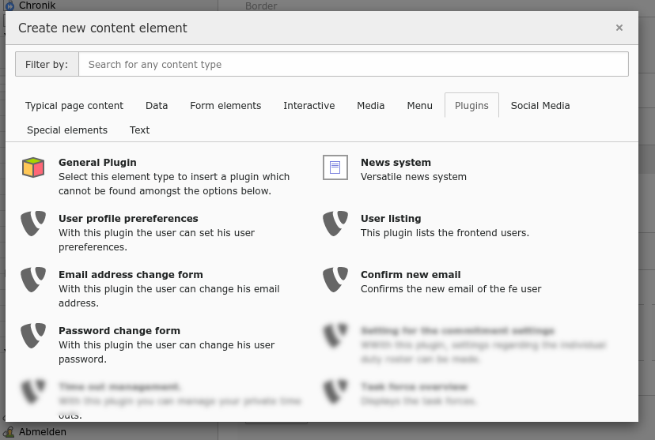

# Typo3 Extension :: usertools
This extension contains a collection of user tools: 
- frontend plugin for listing of all frontend users 
- frontend plugins for editing of the frontend user profile 
	- image
	- phone number
	- email address
	- password 
	- visualisation properties

## Limitations
* **DEPENDENCIES:**  
	- TYPO3 (11.5.0 - 11.5.99)
	- bootstrap_package (12.0.0 - 13.0.99)

## Installation

You can install the extension via the extensions module or via composer.json. 

 

In the second step you have to add the plugin to the TypoScript. To do this, you need to add the TypoScript of the plugin via the static template. 

## Configuration 

## Using

### Select the your frontend plugin

 

#### Frontend plugin: user profiles preferences

* **Visbible frontend user groups** :: The plugin displays the group membership of the user, but only the selected groups.
* **Storage folder for the user image** :: All user pictures are saved in specified folder. 

#### Frontend plugin: Email address change form

* **Redirection link after successful e-mail change ** :: The user gets a address confirm mail with a link (is the email adress correct?). The link refers to the 
specified page. Important: The page must contain the email confirm plugin. 
* **Sender name** :: is the sender name from the address confirm mail. 
* **Sender email address** :: is the sender email address from the address confirm mail. 

#### Frontend plugin: Confirm the new email

You do not have any plugin specific settings. You only need to place this plugin on a public page to confirm the new email address.

#### Frontend plugin: Password change form

You do not have any plugin specific settings. 

#### Frontend plugin: User listing

* **Can always view the phone numbers** :: All frontend user with this group membershhip can always look the phone numbers.
* **Can view the currenty off duty flag** :: All frontend user with this group membershhip can always look the "currenty off duty" flag.
* **Visbible frontend user groups** :: The plugin displays the group membership of the user, but only the selected groups.
* **Alternative link if the user has not public his email address** :: This is displayed if the user has set private the own email. 

### The frontend user data record...

has a new "Private user preferences" sheet. You can see but you can not change the private preference of the frontend user. 

You can only the flag "currently off duty". 

